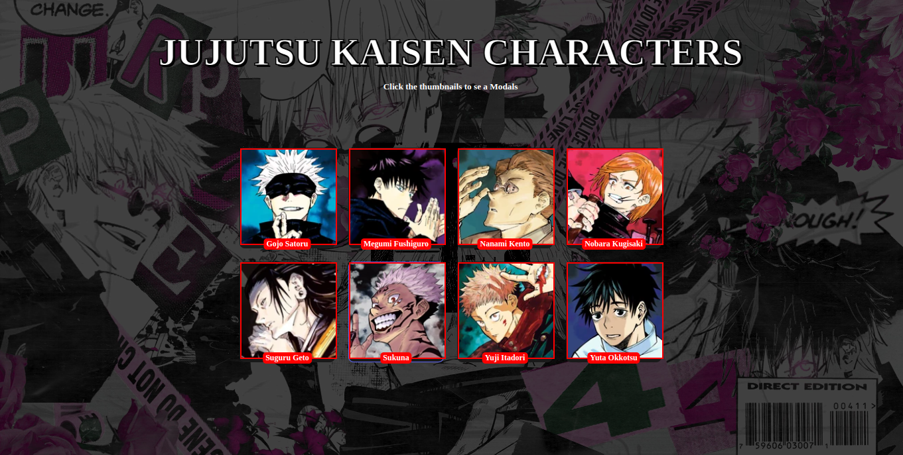

<div id="top"></div>

<div align="center">
  <h2 align="center">Jujutsu Kaisen Modal Pop-up</h2>
  <p align="center">
    <br />
    <br />
    <a href="https://weather-app-95w.pages.dev/#/current-location">View Demo</a>
    ·
    <a href="https://github.com/mahdipratama/may-weather" target="_blank">Report Bug</a>
    ·
  </p>
</div>

<!-- Bagdes -->
<div align="center">
  <!-- Profile -->

  <!-- Status -->
  <a href="#">
    
  </a>

</div>

#

<div align="center">



</div>

I build this Modal-popup.app with React.js, CSS and bundling with Vite, it's help me to retrain my knowledge and practicing more about useState and Props, what I've learned from this project

- Structuring Constant
- Conditional Rendering List
- Passing down Data with Props
- Communicate Between Components with useState
- Render and update the content with useState

<h2 align="center">Links</h2>

- Live Site URL: [https://weather-app-95w.pages.dev/#/current-location](https://weather-app-95w.pages.dev/#/current-location)

<br>

## Table of contents

- [](#)
  - [Table of contents](#table-of-contents)
  - [My process](#my-process)
    - [Built with](#built-with)
  - [Acknowledgments](#acknowledgments)

## My process

### Built with

<!-- Bagdes -->


- Semantic HTML5 markup
- Mobile-first approach
- Flex Layout
- [SASS](https://sass-lang.com/documentation/modules) - Sass modules
- [Openeathermap API](https://openweathermap.org/) - weather API

## Acknowledgments

When using `sass` in order to build this solution

- Install `sass` if not yet installed:

```bash
npm install -g sass
```

- Run build command from command line:

```bash
npm install gulp gulp-sass sass --save-dev
```

- If you want to edit the code and test, in the root folder of this repository, run this command from the command line:

```bash
gulp
```
